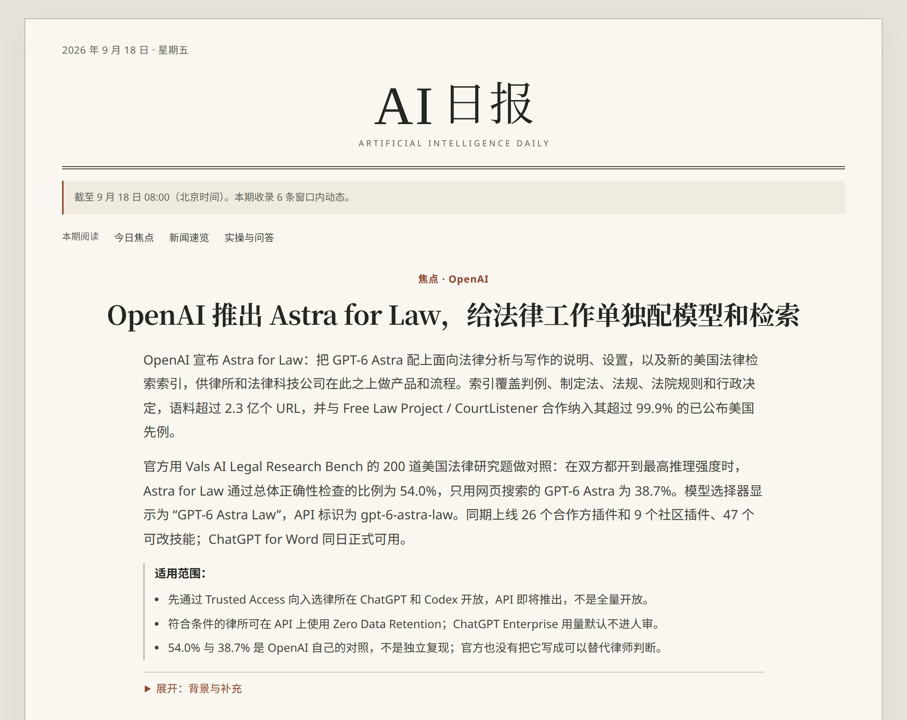
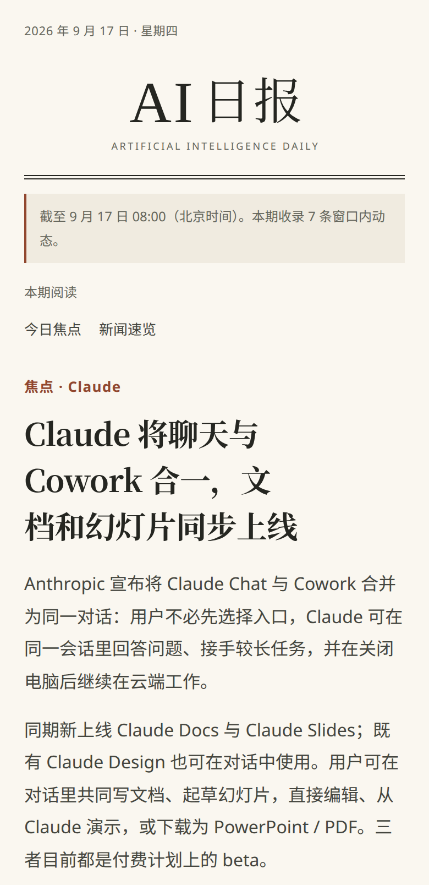

<div align="center">


# AI Daily Brief

A verifiable Chinese AI daily — only the important changes, never padded to a quota.

从公开一手来源和已核验候选里筛出重要变更，写成同一期，供网页、邮件和群阅读。

[打开网页版](https://statefulai.github.io/ai-daily-brief/) · [往期目录](https://statefulai.github.io/ai-daily-brief/)

</div>

公开首页即往期目录。下面两期是已经上线的例子，用来说明版式和写法，不是会自动改写的「最新一期」列表。

## 目录

- [真实期次（示例）](#真实期次示例)
- [产品原则](#产品原则)
- [如何运作](#如何运作)
- [本地开发](#本地开发)
- [License](#license)

## 真实期次（示例）

### 2026-09-18

<a href="https://statefulai.github.io/ai-daily-brief/editions/2026-09-18/"></a>

**[OpenAI 推出 Astra for Law，给法律工作单独配模型和检索](https://statefulai.github.io/ai-daily-brief/editions/2026-09-18/)**

OpenAI 把 GPT-6 Astra 配上法律分析说明和新的美国法律检索索引，先通过 Trusted Access 向入选律所开放。这一期按窗口实写 6 条，不是固定篇数。

[阅读完整一期](https://statefulai.github.io/ai-daily-brief/editions/2026-09-18/)

### 2026-09-17

<p align="center">
  <a href="https://statefulai.github.io/ai-daily-brief/editions/2026-09-17/"></a>
</p>

**[Claude 将聊天与 Cowork 合一，文档和幻灯片同步上线](https://statefulai.github.io/ai-daily-brief/editions/2026-09-17/)**

Anthropic 把 Claude Chat 与 Cowork 并进同一对话，并上线 Docs / Slides。这一期按窗口实写 7 条。

[阅读完整一期](https://statefulai.github.io/ai-daily-brief/editions/2026-09-17/)

## 产品原则

- 回到公开一手来源核对事实、时间和适用范围，核验缺口写进正文，不靠转述补全。
- 当天有多少条真正重要的变化，就写多少条；不为凑数而灌版。
- 没有新价值就不发刊。来源或核验失败会单独作为失败，而不会写成「今天没有新闻」。
- 网页、邮件、群读到的是同一期文章：邮件发送完整 `email.html`，群发送完整纯文本（该渠道不能渲染 HTML）。
- 公开期次由结构化 `edition.json`、固定模板和 CI 生成，不手写 HTML。

## 如何运作

1. **汇集候选。** 读取公开一手来源，并可并入已核验、且标明可公开的供稿。期次窗口为北京时间 `[前一日 08:00, 当日 08:00)`。
2. **Jev 辅助判断。** Jev 是 TypeSafe 提供的 AI 评估模型。本项目把已采集的候选新闻和既往报道交给它，辅助判断“有没有新变化、值不值得读”。生成日报的 Cloud Agent 仍负责核实来源和最终选稿；Jev 出错或额度用完时，日报继续原有流程。官方说明见 [Jev 简介](https://docs.typesafe.ai/introduction)。调用、密钥、关闭（`JEV_ASSIST=0`）与额度交接见 [`generation/CA-JEV-ASSIST.md`](generation/CA-JEV-ASSIST.md)。
3. **回源核验并最终选稿。** Cloud Agent 回到公开一手来源核对事实，并决定写哪些重要变化。Jev 分数不能单独入选、淘汰或裁定空刊。
4. **写成结构化期次。** 产出 `edition.json`，再用固定模板生成 HTML。
5. **先校验，再发布网页。** 打开 pull request 后，CI 校验 schema、来源、内容 hash 和 HTML；合入 `main` 后才部署到 [GitHub Pages](https://statefulai.github.io/ai-daily-brief/)。
6. **按同一期准备投递。** 邮件必须是完整 `email.html` 正文，禁止改成摘要卡片；群必须是同一批文章的完整纯文本，禁止只发短要点或原始 HTML 标签。`published_candidate` 只表示期次已写成可发布稿，不等于网页已经上线，也不等于邮件或群已经发出。

## 本地开发

生产期次由 Cloud Agent 用自身模型完成公开采集、供稿合并和策展，再调用本仓库的固定渲染与校验；Python 不需要拿到 Cloud Agent 的模型 API Key。`main.py` 是本地独立路径，走 OpenAI 兼容接口。

Grok Bot 如何把闪报转成通用供稿，见 [`integrations/grok_bot/README.md`](integrations/grok_bot/README.md)。

### 安装与运行

需要 Python 3.11 或更高版本。

```bash
git clone https://github.com/statefulai/ai-daily-brief.git
cd ai-daily-brief
python -m venv .venv
source .venv/bin/activate
pip install -r requirements.txt
cp .env.example .env
```

在 `.env` 中至少填写：

```env
OPENAI_API_KEY=your-api-key
```

若使用其他 OpenAI 兼容服务，再设置端点和模型：

```env
OPENAI_BASE_URL=https://your-provider.example/v1
AI_NEWS_MODEL=your-model-name
```

本项目尚未对所有兼容服务做全新 clone 验收；如遇到响应格式差异，请提交可复现问题。`config.yaml` 控制本地数据源、模型和输出目录；环境变量优先于其中的模型端点与模型名。

生产 Cloud Agent 在合并候选后调用 `python scripts/jev_assist.py`。Jev 默认开启；出错或额度用完时跳过并继续原选稿。关闭请设 `JEV_ASSIST=0`。操作细节见 [`generation/CA-JEV-ASSIST.md`](generation/CA-JEV-ASSIST.md)。

```bash
# 完整本地流程；只有 published_candidate 才写 editions/<date>/
# 成功策展时仍可能更新 daily-brief.md / archives/
python main.py

# 只读取来源，不调用模型，也不写期次
python main.py --sources-only

# 打印结构化期次，不写 editions/ 或公开产物
# Jev 若真正发请求，仍可能写入私有配额文件
python main.py --dry-run

# 使用另一份配置
python main.py --config path/to/config.yaml

# 合并一份可选供稿；不传该参数时只使用公开来源
python main.py --contributions path/to/contributions.json
```

08:00 前手动运行时，仍然指向最近一个已经闭合的北京时间窗口。

### 可选供稿

`--contributions` 是本地和外部系统并入候选的唯一入口。不传参数时只使用公开来源；显式传入的文件如果缺失、格式错误或不符合契约，生成会直接失败。只有 `sensitivity: public` 且 `source_time` 落在同一日报窗口内的记录会进入候选，入选后仍会重新抓取一手来源。

<details>
<summary>供稿记录最小字段</summary>

```json
{
  "event": "某项模型能力开放",
  "primary_source": {
    "title": "官方公告",
    "url": "https://example.com/announcement",
    "published_at": "2026-09-16T01:00:00+08:00"
  },
  "source_time": "2026-09-16T01:00:00+08:00",
  "verified_facts": ["官方开放了该能力。"],
  "conditions": ["仅适用于已开放账号。"],
  "sensitivity": "public"
}
```

</details>

### 正式期次目录

每个公开期次只包含：

```text
editions/YYYY-MM-DD/
├── edition.json
└── index.html
```

`published_candidate` 才会写入该目录。`no_new_value` 表示来源读取成功但没有值得发布的新内容；`failed` 表示来源、模型或核验失败。这两种结果都不创建公开期次，也不能互相冒充。原始供稿、发送凭据和收件人信息不进入公开期次。

### 验证

```bash
python -m unittest discover -s tests -v
python scripts/edition_ci.py render --edition editions/<date>/edition.json
python scripts/edition_ci.py validate
python scripts/edition_ci.py build --output _site
```

`validate` 在没有正式期次时会成功并报告 0 期；`_site/` 是本地构建目录，不进入版本库。

### 仓库结构

```text
main.py                    # 本地独立运行
edition.py / curate.py / verify.py
generation/jev/            # Jev 辅助判断（客户端、配额、复用）
templates/                 # 固定网页与邮件模板
scripts/edition_ci.py      # 校验与 Pages 构建
scripts/jev_assist.py      # Cloud Agent 合并候选后的 Jev 入口
editions/YYYY-MM-DD/       # 正式期次
integrations/grok_bot/     # 供稿桥接说明
delivery/                  # 邮件与群的正文契约
tests/
```

## License

[MIT](./LICENSE)
