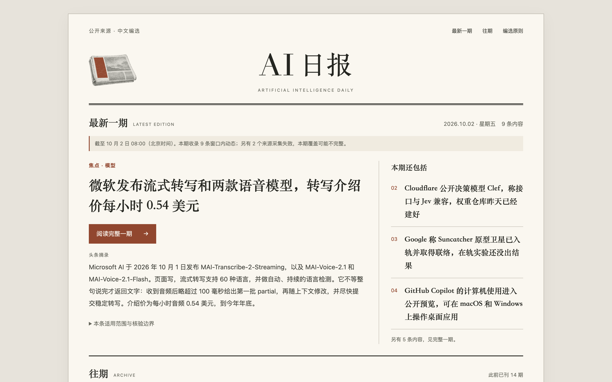

<div align="center">

<a href="https://brief.sanze.dev/"></a>

<sub>首页版式示意，取自 2026-10-02 期；最新内容以网页为准。</sub>

# AI 日报

公开来源，中文编选。

**[阅读最新一期 →](https://brief.sanze.dev/)**

</div>

每期挑出当天重要的 AI 变化，逐条回到公开的一手来源核对后再写。

## 每一期有什么

- **头条和新闻速览**：最重要的一条放在头条，其余放在新闻速览；有操作步骤或问答时，另设「实操与问答」。
- **来源与边界**：每条附来源链接；适用范围和没能核实的地方，写在这一条里。
- **往期**：首页按月列出全部往期，点开就是当期全文。

## 编选原则

- 核对事实、时间和适用范围；没能核实的地方直接写明，不靠转述补全。
- 有多少条真正重要的变化，就写多少条，不凑数。
- 没有新价值就不发刊。来源或核验失败会单独说明，不写成「今天没有新闻」。
- 投递到邮件和群的也是这一期全文：邮件是完整正文，群是完整纯文本，不发摘要。

## 维护与开发

### 出刊流程

- 汇集候选：公开一手来源，并可并入已核验、标明可公开的供稿。窗口为北京时间 `[前一日 08:00, 当日 08:00)`。
- Jev 辅助判断有没有新变化、值不值得读；分数不能单独入选、淘汰或裁定空刊。调用与关闭见 [`generation/CA-JEV-ASSIST.md`](generation/CA-JEV-ASSIST.md)。
- Cloud Agent 回源核验并最终选稿，写成 `edition.json`，再用固定模板生成 HTML。公开期次不手写 HTML。
- Pull request 上 CI 校验 schema、来源、内容 hash 和 HTML；合入 `main` 后发布到 [https://brief.sanze.dev/](https://brief.sanze.dev/)。
- 投递同一期，契约在 [`delivery/`](delivery/)：邮件是完整 `email.html`，群是完整纯文本。
- `published_candidate` 只表示期次已写成可发布稿，才会写入 `editions/YYYY-MM-DD/`；不等于网页已上线，也不等于邮件或群已发出。`no_new_value` 与 `failed` 都不创建公开期次，也不能互相冒充。

### 本地开发

需要 Python 3.11+。在 `.env` 填写 `OPENAI_API_KEY`。08:00 前手动运行，仍指向最近一个已经闭合的北京时间窗口。

```bash
git clone https://github.com/statefulai/ai-daily-brief.git
cd ai-daily-brief
python -m venv .venv
source .venv/bin/activate
pip install -r requirements.txt
cp .env.example .env

python main.py                  # 只有 published_candidate 才写 editions/<date>/
python main.py --sources-only  # 只读来源，不调用模型
python main.py --dry-run       # 不写期次
python -m unittest discover -s tests -v
python scripts/edition_ci.py validate
```

可选：`python main.py --config path/to/config.yaml`，`python main.py --contributions path/to/contributions.json`（不传则只用公开来源）。供稿桥接见 [`integrations/grok_bot/README.md`](integrations/grok_bot/README.md)。

仓库：`main.py` 本地运行；[`generation/`](generation/) 选稿辅助；[`delivery/`](delivery/) 邮件与群正文；`templates/`、`scripts/edition_ci.py` 渲染与校验；`editions/` 正式期次。

## License

[MIT](./LICENSE)
